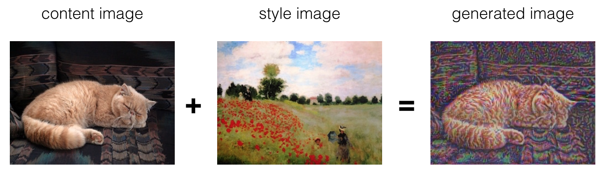

# Neural Style Transfer for Art Generation

This repository provides an implementation of neural style transfer, a technique used to generate artistic images by combining the content of one image with the style of another image. The implementation utilizes pre-trained models and allows customization of various parameters to achieve desired artistic effects.

## Usage

1. **Clone the repository:**

    ```bash
    git clone https://github.com/Rachelslh/Neural_Style_Transfer.git
    cd your-repo
    ```

2. **Install the required dependencies:**

    ```bash
    pip install -r requirements.txt
    ```

3. **Customize the configuration:**

    Modify the `config.yaml` file to specify the desired settings for the style transfer process. The available options include:
    
    - `backbone_model`: Choose the backbone model for feature extraction. Supported options include VGG.
    - `pretrained_weights`: Path to the pre-trained weights file for the chosen backbone model.
    - `img_size`: Size of the generated image.
    - `learning_rate`: Learning rate for optimization.
    - `epochs`: Number of optimization iterations.
    - `content_image_path`: Path to the content image.
    - `style_image_path`: Path to the style image.
    - `content_layer`: Layer used for content representation.
    - `style_layers_with_weights`: Specify style layers and their corresponding weights.
    - `alpha`: Weight parameter for content loss.
    - `beta`: Weight parameter for style loss.

4. **Run the style transfer algorithm:**

    ```bash
    python style_transfer.py
    ```

    The generated image will be saved in the `images` directory.

## Example

To demonstrate the usage of the neural style transfer algorithm, this repository includes sample content and style images. You can use the provided images or replace them with your own images to experiment with different artistic styles.




## Contributing

Contributions are welcome! If you have any suggestions, bug reports, or enhancements, please feel free to open an issue or submit a pull request.
Currently, this may be buggy as the output image is not really what it supposed to be, will try to address fixes when possible.